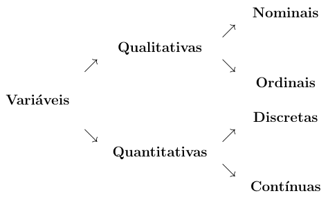

# Introdução à Análise Estatística
A estatística começou como uma maneira do estado coletar informações de sua população e economia, mas evoluiu para que se tornasse essencial para a vida de todos. Isso é facilmente observável em remédios, que dependem de diversos testes para gerar informações, que posteriormente são tratadas com o uso da estatística para decidir se o medicamento é seguro e eficaz. 
A estatística pode ser dividia em 3 grandes áreas:
- Estatística Descritiva:    
  Utilizada comunmente em um primeiro contato com dados, para que sejam descritos e resumidos, com o objetivo de se tirar concluções informais a respeito dele.
- Probabilidade:     
  Pode ser interpretada como a teoria matemática utilizada para se estudar a incerteza oriunda de fenômenos de caráteer aleatório.
- Inferência estatística:    
  O estudo de técnicas que possibilitam a extrapolação, a um grande conjunto de dados, a partir das informações e conclusões obtidas de subconjuntos de valores, usualmente de dimensão muito menor.

## Variáveis e Suas Classificações
Variáveis são características de interesse em um experimento que podem ser medidas ou categorizadas e variam de acordo com o indivíduo. Antes de se iniciar um experimento, em seu planejamento, é extremamente importante definir quais são as variáveis de interesse.
- Exemplos:
  - Sexo
  - Idade
  - Temperatura
  - Altura    

Podem ser dvididas em categorias:     

- Qualitativa (categorizada): 
  - Nominal:     
    É uma variável que pode ser categorizada, mas que não tem uma ordenação natural das categorias, um exemplo é o estado civíl de eleitores (casado, solteiro, viúvo, etc). 
  - Ordinal:     
    É uma variável que pode ser categorizada e tem uma ordenação natural das categorias, por exemplo, o nível de colesterol no sangue de pacientes hipertensos (baixo, aceitável, alto, etc.)

- Quantitativa (mensurável): 
  - Discreta:     
    É uma variável que pode ser mensurável, mas suas medidas podem apenas assumir valores inteiros, como o número de peças de uma máquina (3 peças, 500 peças, etc.)
  - Contínua:    
    É uma variável que é mensurável e suas medidas podem assumir qualquer valor no conjunto dos números reais. Por exemplo: Temperatura em graus célsius (80°C; 85, 28°C;, etc)

## Amostragem
O grande conjunto de dados que contém as variáveis selecionadas, é chamado de população. Em alguns casos é possível analisar toda a população, mas na maioria das vezes isso é impraticável. Para esses casos, uma amostragem é utilizada, uma fração menor da população selecionada de acordo com diversos fatores, que se pressupõe possuir o mesmo comportamento da população.