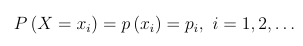
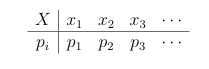

# Aula 4
## Conceitos básicos de probabilidade 
A probabilidade estuda a incerteza de fenômenos aleatórios. Esses que são observados a partir de um exeperimênto deterministico, ou seja, que não pode ser determinado com certeza.

### Variáveis Aleatórias Discretas
Uma variável pode ser chamada de aleatória discreta se assume apenas valores inteiros e com certa probabilidade de ocorrência, o comportamento dela pode ser estudado a partir da função discreta de probailidade, essa que atribui a probabilidade de ocorrência de cada valor da variável aleatória e é denominada de _função de probabilidade_

ou

#### Modelo Uniforme Discreto
Se X é uma variável discreta cujos valores possíveis são representados por x1, x2, x3, x4...xk. A variável aleatória X vai seguir distribuição Uniforme Discreta.

#### Modelo de Bernoulli
Se a variável X é discreta e seus valores são dicotômicos, 0 ou 1 e representam a ocorrência de fracasso e sucesso, respectivamente.

#### Modelo de Poisson
Uma variável X que representa o número de ocorrências de um evento de interesse num determinado intervalo de tempo.

### Variáveis Aleatórias Contínuas
Uma quantidade X é denominada variável aleatória contínua se assume valores num conjunto não enumerável, ou seja, ela pode assumir qualquer valor pertencente a um intervalo dos números reais.

#### Modelo Uniforme Contínuo
O comportamento desse tipo de variável é independente dos valores que a variável aleatória X assume, sua f.d.p sempre será a mesma.

#### Modelo Exponencial
Uma variável aleatória contínua X, assumento valores não negativos. O comportamento de sua f.d.p é decrescente.

#### Modelo Normal
Para miutas variáveis aleatórias contínuas, a distribuição de probabilidade é representada por uma curva específica, em formato de sino, chamada de curva normal ou curva gaussiana. 
