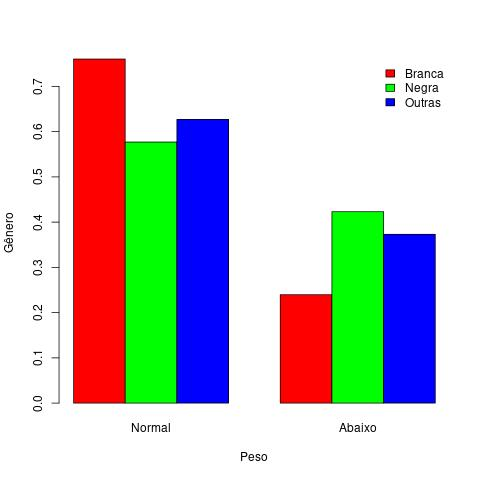

# Avaliação 1 - Probabilidade e estatística

## 1) A idade da gestante interfere no nível de peso da criança (normal, baixo).

Tabela 1.1: Descrição da variável Idade separada por peso
| Peso | Média | Mediana | Desvio Padrão | Amplitude | Intervalo interquartil |
|-|-|-|-|-|-|
| Normal | 23,66 | 23 | 5,58 | 31 | 9,0 |
| Abaixo | 22,30 | 22 | 4,51 | 20 | 5,5 |

> **Interpretação**: Observando os resultados da Tabela 1.1 é possível verificar que a média de idade das gestantes que geraram crianças com peso normal é de 23,66 anos, enquanto que a média de idade das gestantes que geraram crianças abaixo do peso é de 22,30 ano. Também é possível observar que a mediana da idade das gestantes que geraram crianças com peso normal é de 23 anos, enquanto que a mediana das que geraram crianças abaixo do peso é de 22 anos, levando em consideração essas informações, conclui-se que a idade da gestante não tem relação significativa com o peso da criança.    
> Observando a amplitutde da idade das gestante para os pesos das crianças, verifica-se que a variabilidade máxima da idade foi de 31 anos para o peso normal e de 20 anos para criançar abaixo do peso. Conclui-se que a variabilidade máxima de idade em crianças com o peso normal é maior do que a variabilidade máxima em crianças abaixo do peso.    
> Observa-se nos desvios padrões que a variabilidade da idade da gestante que geraram crianças com peso normal é de 5,58 anos, enquanto que em gestantes que geraram crianças abaixo do peso é de 4,51 anos. Com base nos intervalos interquartis, observa-se que a variabilidade de idade das gestantes que geraram crianças com peso normal é de 9 anos, enquanto que as que geraram crianças abaixo do peso é de 5,5 anos. A partir da comparação dos desvios padrões  e dos intervalos interquartis para a idade das gestantes, considerando o peso das crianças, conclui-se que, a variabilidade de idade das gestantes que geram crianças abaixo do peso é menor do que a das gestantes que geram crianças com peso normal. 

Figura 1.1: Boxplot para a variável de idade de gestantes separada por peso
 

> **Interpretação**: As conclusões da _Tabela 1.1_ são as mesmas da _Figura 1.1_, sendo assim, é possível concluir que a idade das gestantes que geraram crianças com peso normal e que geraram crianças abaixo do peso é, considerando a média e mediana, muito próxima (linhas centrais próximas), observa-se também que a variabilidade de idade das gestantes que geraram crianças abaixo do peso é menor do que as que geraram crianças com peso normal (caixas com tamanhos diferentes), o mesmo acontece com a variabilidade máxima (distância entre os valores máximo e mínimo), além disso, existe em ambas os níveis de peso um valor discrepante (ponto acima do valor máximo). Portanto, aparentemente, a idade não interfere no nível de peso da criança.

___

## 2) O nível de peso da criança (normal, baixo) está associado com o gênero da gestante.

Tabela 2.1: Nível de peso da criança vs Gênero da gestante
<table align="center">
<thead>
  <tr>
    <th rowspan="2">Peso</th>
    <th colspan="3">Gênero</th>
  </tr>
  <tr>
    <td>Branca</td>
    <td>Negra</td>
    <td>Outras</td>
  </tr>
</thead>
<tbody>
  <tr>
    <td>Normal</td>
    <td>73 (76%)</td>
    <td>15 (58%)</td>
    <td>42 (63%)</td>
  </tr>
  <tr>
    <td>Abaixo</td>
    <td>23 (24%)</td>
    <td>11 (42%)</td>
    <td>25 (37%)</td>
  </tr>
</tbody>
</table>

> **Interpretação**: Na Tabela 2.1 é possível observar que 76% das gestantes brancas geraram crianças com peso normal, enquanto que 24% das gestantes brancas geraram crianças abaixo do peso, já 58% das gestantes negras geraram crianças com peso normal, enquanto os outros 42% geraram crianças abaixo do peso e dentre os outros gêneros, 63% geraram crianças com peso normal e 37% geraram crianças abaixo do peso. Portanto, é possível concluir que gestantes negras tem uma probabilidade equilibrada de gerarem crianças com peso normal e abaixo do peso, apesar da maior parte ter o peso normal, já as gestantes brancas tem maior probabilidade de terem crianças com peso normal, o mesmo ocorre com gestantes de outros gêneros.

Figura 2.1: Barplot para a variável de idade de gestantes separada por gênero
 

> **Interpretação**: As conclusões observadas a partir da _Tabela 2.1_ são as mesmas observadas na _Figura 2.1_, portanto, conclui-se que a maior parte das crianças geradas por gestantes brancas tem peso normal, o mesmo ocorre com gestantes de outros gêneros, porém em menor nível, já em gestantes negras, é mais equilibrado, mesmo também tendo uma maior quantidade de crianças com peso normal.