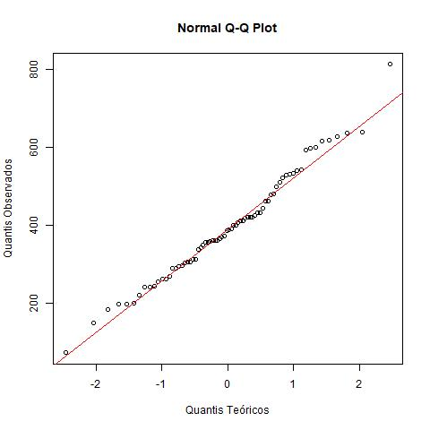
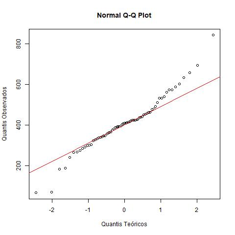

# Avaliação 3 - Probabilidade e estatística

## 1) O tempo de sobrevivência (Tempo) é afetado pelo tipo de tratamento (Tratamento)

> **1. Identificar H0 e H1:**  Como o interesse é verificar se o tempo de sobrevivência é afetado pelo tipo de tratamento, as seguintes hipóteses podem ser testadas:     
>    H0: µtA = µtB    
>    H1: µtA ≠ µtB    
> Em que µtA é a média do tempo de sobrevivência dos pacientes submetidos ao tratamento do tipo A
> e µtB é a média do tempo de sobreviviência dos pacientes submentidos ao tratamento do tipo B.

> **2. Escolher o teste estatístico:** Para testar essas hipóteses, é necessário escolher um teste estatístico adequado, como os pacientes testados não são os mesmos para os diferentes tratamentos, é possível identificar que as amostras são independentes. As variâncias populacionais para os diferentes grupos são desconhecidas, então é necessário realizar um teste-F para comparação entre variâncias, obtendo assim p-valor = 0,691328, como o p−valor > α (α = 5%), a hipótese de igualdade entre variâncias é aceita. Então teste-t para amostras independêntes com variâncias populacionais iguais será utilizado.

> **3. Fixar o nível de significância:** Cometer o erro do tipo 1 nesse caso é dizer que a média do tempo de sobrevivência dos pacientes submetidos ao tratamento do tipo A é diferente da média de sobrevivência dos pacientes submetidos ao tratamento do tipo B, quando na população a média do tempo de sobrevivência é o mesmo. Supor que o grau de gravidade em cometer esse erro é mediano, então o nível de significância estipulado aqui é de 5%.    
> Esse teste tem como pressuposto que variável aleatória quantitativa segue distribuição normal para os dois grupos, para determinar isso, é necessário observar os gráficos das *Figuras 1.1 e 1.2* e aplicar o teste de Shapiro-Wilk em ambos os grupos, assim, tem-se, p-valor*tA* = 0,5112 e p-valor*tB* = 0,05761. Como o p-valor de ambos é menor do que α, podemos dizer que ambos seguem distribuiçao normal.

> **4. Calcular os valores observados para o teste estatístico a partir dos dados amostrais:** 
> Utilizando o teste-t para amostras independêntes com variâncias populacionais iguais, observa-se um p-valor = 0,5196, portanto, como p−valor > α (α = 5%), com 5% de significância, existem evidências de que não existem diferenças entre o tratamento A e B, com um intervalo de confiânça de -51 a 22 dias, observando-se que 0 está dentro desse intervalo. Portanto, a hipótese nula é aceita.

Figura 1.1: Gráfico de normalidade para o tratamento A
 

Figura 1.2: Gráfico de normalidade para o tratamento B
 

___

## 2) O tempo de sobrevivência (Tempo) é afetado pelo grau em que a célula do tumor se assemelha a célula hospedeira (Grau)

Tabela 2.1: Nível de peso da criança vs Gênero da gestante

> **Interpretação**: 

Figura 2.1: Barplot para a variável de idade de gestantes separada por gênero
 

## 3) O tempo de sobrevivência (Tempo) é afetado pelo local em que o tumor estava alojado ao iniciar o tratamento (Local)

> **Interpretação**: 

## 4) O tempo de sobrevivência (Tempo) está correlacionado com a  idade do paciente no dia do diagnóstico da doença (Idade)

> **Interpretação**: 

## 5) O grau em que a célula do tumor se assemelha a célula hospedeira (Grau) está associada ao local em que o tumor estava alojado ao iniciar o tratamento (Local).

> **Interpretação**: 
