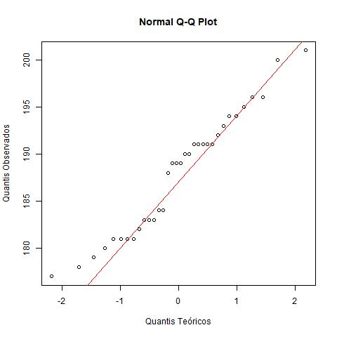
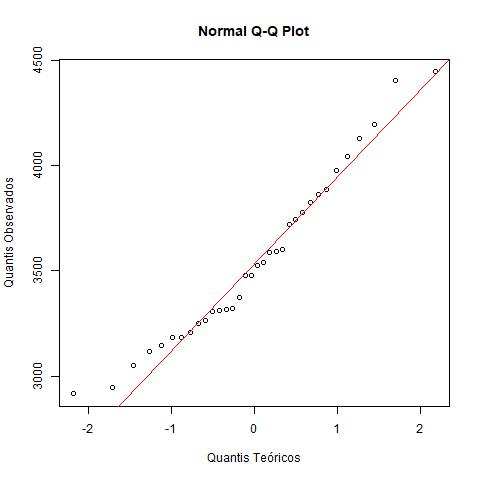
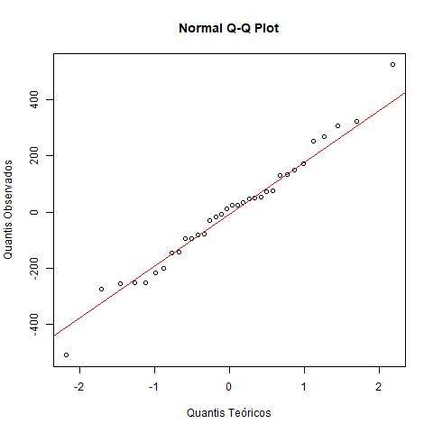

# Avaliação 3 - Probabilidade e estatística | Pedro Tashima - 2145200

## 1 - O número de sacas produzidas por hectare está correlacionada com o custo do cultivo por hectare;

> **1. Identificar *H0* e *H1*:**  Como o interesse é verificar se o número de sacas produzidas por hectare está correlacionada com o custo do cultivo por hectare, as seguintes hipóteses são testadas:    
>    *H0* : ρ = 0 (Não há correlação)    
>    *H1* : ρ ≠ 0 (Há correlação)       
> O interesse é verificar se o coeficiente de correlação ρ é igual ou diferente de zero, caso seja igual, existem evidências de que as variávies quantitativas não estão relacionadas, caso seja diferente, existen evidências de que as variáveis quantitativas estão relacionadas.

> **2. Escolher o teste estatístico:** As duas variáveis são quantitativas e o que está sendo obervado é a correlação entre elas, então o teste utilizado será o de Correlação de Pearson.

> **3. Fixar o nível de significância:** Cometer o erro do tipo 1 nesse caso é dizer que o número de sacas produzidas por hectare está correlacionado com o custo do cultivo por hectare, quando na população essas duas variáveis não estão relacionadas. Supor que o grau de gravidade em cometer esse erro é brando, então o nível de siginificância é estipulado em α = 10%.    
> Esse teste tem como pressuposto que o as duas variávies aleatórias seguem distribuição normal, observando os gráficos das Figuras 1.1 e 1.2 e os p-valores obtidos pelo teste de Shapiro-Wilk, sendo p-valor = 0,1703 para o custo de produção por hectare e p-valor = 0,2285 para o número de sacas produzidas por hectare, pode-se dizer que ambas variáveis seguem distribuição normal. 

> **4. Calcular os valores observados para o teste estatístico a partir dos dados amostrais:** 
> Utilizando o Teste de Correlação de Pearson, verifica-se que o p-valor = 1,079e-05 e o intervalo de confiança é IC(ρ,90%) = [0,4845906; 0,8075047].

> **5. Verifica se rejeita ou não a hipótese nula *H0*:** Com base nos dados obtidos no Teste de Correlação de Pearson, observa-se que o p-valor = 1,079e-05 é menor do que o nível de significância definido de α = 10%, portanto, com 10% de significância, existem indícios de que há correlação entre o número de sacas produzidas por hectare e o custo do cultivo por hectare. Com 90% de confiabilidade, existem também evidências de que há uma correlação positiva e fraca, em que, quanto maior o custo de produção por hectare, maior a quantidade de sacas produzidas.

Figura 1.1: Gráfico de normalidade para o número de sacas produzidas por hectare
 

Figura 1.2: Gráfico de normalidade para custo do cultivo por hectare

___

## 2 - O custo do cultivo por hectare é afetado pelo método de cultivo.

> **1. Identificar *H0* e *H1*:**  Como o interesse é verificar se o o custo do cultivo por hectare é afetado pelo método do cultivo, as seguintes hipóteses são testadas:    
>    *H0* : µA = µB = µC = µD   
>    *H1* : Pelo menos uma das médias é diferente das demais.       
> Onde, µA, µB, µC e µD são respectivamente as médias dos custos de cultivo dos métodos A, B, C e D.

> **2. Escolher o teste estatístico:** O interesse nesse caso é testar a igualdade entre mais de duas méidas, então o método escolhido é o ANOVA-oneway.

> **3. Fixar o nível de significância:** Cometer o erro do tipo 1 nesse caso é dizer que, de acordo com a amostra de pelo menos uma das médias do custo de produção por hectare é diferente das demais, quando na população todas as médias sao iguais.  Supor que o grau de gravidade em cometer esse erro é grave, então o nível de significância estipulado é  α = 1%.    
> Utilizando o teste de Shapiro-Wilk, obtem-se o p-valor = 0,8936 dos resíduos do teste ANOVA-oneway, que é maior do que o nível de significância definido (α = 1%), portanto, observando também o gráfico da Figura 2.1, a hipótese da normalidade dos resíduos não é rejeitada.    
> O p-valor do teste de Goldfeld-Quandt é de p−valor = 0,9407 e o do teste de Breusch-Pagan é de p−valor = 0,1648. Esses p-valores são maiores do que o nível de significância do teste (α = 1%), portanto, não se rejeita a hipótese de homoscedasticidade dos resíduos.     
> O p-valor do teste de Durbin-Watson é p-valor = 0,02158, ou seja, é maior do nível de significância estipulado (α = 1%), então a hipótese de independência dos resíduos não é rejeitada.

> **4. Calcular os valores observados para o teste estatístico a partir dos dados amostrais:** 
> O p-valor obtido utilizando ANOVA-oneway é p-valor = 8,230872e-09.

> **5. Verifica se rejeita ou não a hipótese nula *H0*:** Como o p-valor = 8,230872e-09 observado é menor do que o nível de significância (α = 1%), existem evidências de que pelo menos uma das médias de custo do cultivo por hectare é diferente dos outros.    
> Para identificar qual ou quais das médias diferem, o pós-teste Tukey HSD é utilizado.     
> Temos que:    
> µB = µA, pois o p-valor = 0,6441274 é maior que α,     
> µC ≠ µA, pois o p-valor = 0,0000731 é menor que α,     
> µD ≠ µA, pois o p-valor = 0,0013241 é menor que α,     
> µC ≠ µB, pois o p-valor = 0,0000025 é menor que α,     
> µD = µB, pois o p-valor = 0,0195854 é maior que α,     
> µD ≠ µC, pois o p-valor = 0 é menor que α e     
> IC(µC - µA,90%) = [306,76; 828,50], ou seja, o custo médio por hectare do método C é de R$306,76 a R$828,50 mais caro se comparado ao método A;        
> IC(µD - µA,90%) = [-688,91; -185,85], ou seja, o custo médio por hectare do método D é de R$688,91 a R$185,85 mais barato se comparado ao método A;        
> IC(µC - µB,90%) = [429,71; 939,92], ou seja, o custo médio por hectare do método C é de R$429,71 a R$939,92 mais caro se comparado ao método B;        
> IC(µD - µB,90%) = [-565,73; -74,65], ou seja, o custo médio por hectare do método D é de R$565,73 a R$74,65 mais barato se comparado ao método B;        
> IC(µD - µC,90%) = [-1272,91; -737,10], ou seja, o custo médio por hectare do método D é de R$1272,91 a R$737,10 mais barato se comparado ao método C.        
> Também é importatnte observar que IC(µB - µA,90%) = [-355,03; 120,65]. Os limites desse intervalo contém o valor 0, ou seja, a hipótese nula não é rejeitada.

Figura 2.1: Gráfico de normalidade para os resíduos do modelo da ANOVA-oneway
 